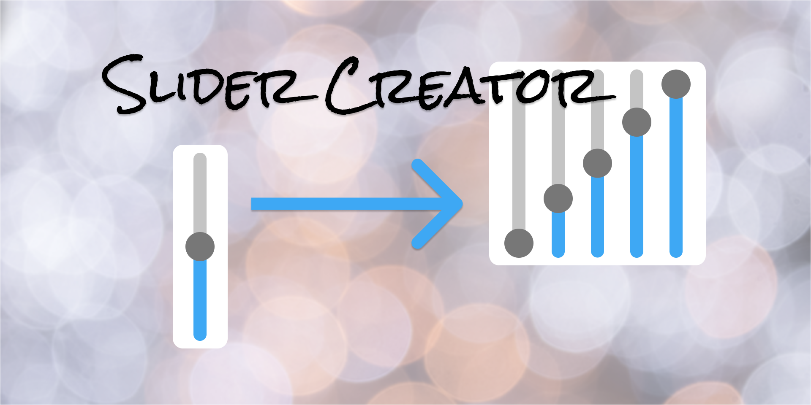

* The start and end position of the `cap` can be set with the `cap-range`
* Create a progress 'bar' with `progress` or `progress-center` if the center of the slider is 0 (panning)
* Set the range of the `progress` with `track`